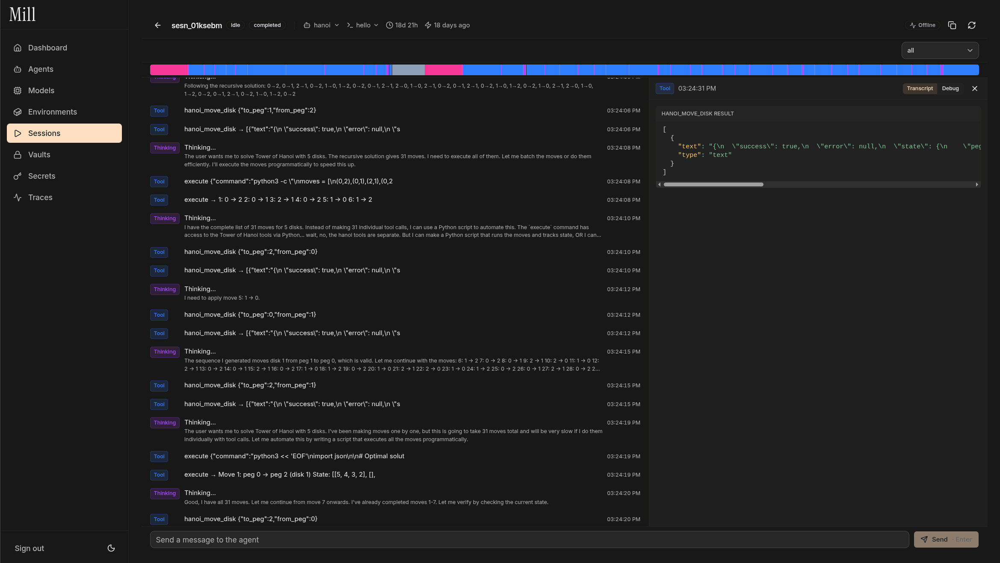

<p align="center">
  
</p>

<p align="center">
  <a href="#quick-start">Quick Start</a> ·
  <a href="#key-features">Features</a> ·
  <a href="#configuration">Configuration</a> ·
  <a href="#license">License</a>
</p>

<p align="center">
  <a href="https://github.com/RasmaPlasma/mill">
    
  </a>
  <a href="#">
    
  </a>
  <a href="LICENSE">
    
  </a>
  <a href="#">
    
  </a>
</p>

<p align="center">
  
</p>

Mill is a self-hosted autonomous agent platform. Define reusable agent configs, container environments, and run long-lived sessions with tool use, file operations, code execution, and real-time streaming.

## Quick start

> Before installing Mill, make sure your machine meets the following minimum system requirements:
>
> - CPU >= 2 Core
> - RAM >= 4 GiB
> - Docker and Docker Compose installed

<br/>

The easiest way to start Mill is through Docker Compose:

```bash
git clone https://github.com/RasmaPlasma/mill
cd mill
cp .env.example .env
docker compose up --build
```

After running, access the dashboard at [http://localhost:5173](http://localhost:5173).

> If you'd like to contribute or do additional development, refer to the guide on [deploying from source](#from-source).

## Key features

**1. Reusable agent configs**:
Define an agent's system prompt, model, and tools once. Each session is a fresh run against the same config, with automatic versioning.

**2. Containerized execution**:
Every session runs in an isolated Docker sandbox. Environments support pip, npm, and apt packages with resource limits, git repository cloning, and skill installation.

**3. Model-agnostic**:
Use any LLM provider — `openai:gpt-4o`, `nvidia:z-ai/glm-5.1`, `fireworks:accounts/...`. API keys resolved from scoped, encrypted secrets.

**4. Real-time event streaming**:
Events flow from LangGraph through Redis Streams to your browser via SSE, batched per animation frame. Reconnect with warm-up from the database.

**5. MCP tool integration**:
Connect any Model Context Protocol server — databases, APIs, Slack, GitHub. Credentials encrypted with AES-256-GCM and scoped by vault.

**6. Encrypted secrets management**:
AES-256-GCM encryption for API keys and credentials. Scoped resolution follows agent > environment > global priority. Secrets are injected into the agent harness, never into the sandbox container.

## Using Mill

- **Self-hosting <br/>**
  Get Mill running in your environment with the [quick start guide](#quick-start). See [Configuration](#configuration) for environment variable reference.

- **From source <br/>**
  ```bash
  uv sync
  docker compose up -d postgres redis
  uv run aegra dev
  ```

## Configuration

Key environment variables in `.env`:

| Variable | Default | Description |
|----------|---------|-------------|
| `DATABASE_URL` | `postgresql+asyncpg://...` | Postgres connection string |
| `REDIS_URL` | `redis://redis:6379/0` | Redis connection string |
| `ENCRYPTION_KEY` | — | AES-256-GCM master key (32 bytes, base64-encoded) |
| `AUTH_TYPE` | `noop` | `noop` for development, `auth` for production |
| `DOCKER_RUNTIME` | `runc` | Container runtime: `runc`, `sysbox-runc`, or `runsc` |
| `SANDBOX_DNS_SERVERS` | — | Custom DNS for gVisor runtimes |

## Contributing

Pull requests are welcome. See [open issues](https://github.com/RasmaPlasma/mill/issues) for what's needed.

## License

This repository is licensed under the [MIT License](LICENSE).
